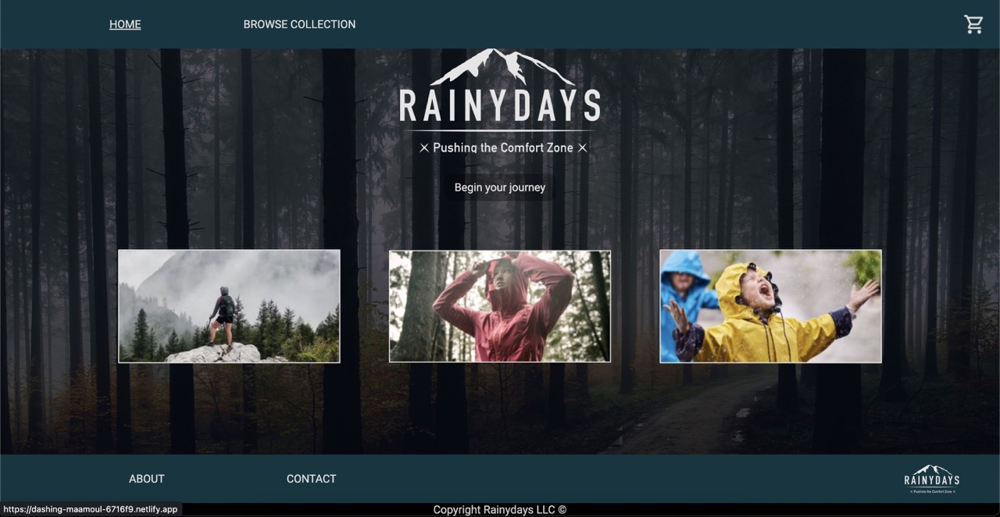

# Rainydays



"Rainydays" is a website used for shopping clothes for a specific targeted audience.
The site contains simple navigational links around the page, which are hardcoded in in HTML and CSS, simulation an interactive website.

## Description

This project wishes to engage an older demographic, perhaps families with children, to buy jackets for all sorts of different outdoors activities. The website is aimed to be straight forward and easy to navigate.

Some bullet points:

- Engaging older audience
- Easy to navigate
- Simple and clean

## Built With

- [HTML]
- [CSS]
- [Figma]

## Getting Started

### Installing

This is where you list how to get the project started. It typically just includes telling a person to clone the repo and then to install the dependencies e.g.

1. Clone the repo:

```bash
git clone git@github.com:Ramsnes/ca-html-css.git
```

### Running

Locate and navigate the cloned repo via the terminal using `cd` to navigate directories, and `ls` to view directories available.

To open the project in you code editor, run the following commands:

```terminal
code .
```

## Contributing

You are welcome to open a pull request to review the code.

## Contact

[My e-mail](morten.ramfjord@gmail.com)
